<div align="center">

# Cursor OS

**An installable operating layer that makes Cursor project-aware.**



[Interactive demo](https://kingemma7.github.io/cursor-os/) · [Quick start](#quick-start) · [How it works](#how-cursor-os-works) · [CLI reference](#cli-reference)

[](https://github.com/KingEmma7/cursor-os/actions/workflows/ci.yml)
[](https://www.npmjs.com/package/cursor-os)
[](package.json)
[](LICENSE)

</div>

> The comparison above is illustrative. Each failure it shows is a pattern that occurs when a model works without project context, but the transcript is written, not recorded, and the counts are not measured.

> **Unofficial project.** Cursor OS is a community-maintained installable layer for Cursor. It is not affiliated with, endorsed by, or maintained by Cursor or Anysphere.

---

## Quick start

Three commands and one paste.

### 1. Install

Run this from the root of the repository you want Cursor to understand. It works on a new
project or a mature codebase; the installer skips any file that already exists.

```bash
cd /path/to/your-project
npx cursor-os init
```

Nothing is installed globally and no dependencies are added to your project. To preview the
file list without writing anything, add `--dry-run`.

```
Cursor OS v0.3.0
Target: /path/to/your-project

Created 20 file(s):
  + .cursor/agents/verifier.md
  + .cursor/rules/core.mdc
  ...
  + AGENTS.md
  + docs/repo-memory.md
  + prompts/localize-cursor-os.md

Post-install check:
  All files installed. 14 placeholder(s) await localization.

Next: open Cursor in your-project and run prompts/localize-cursor-os.md
```

### 2. Review what the installer detected

Optional. This reads your root manifests and reports the stack it can evidence, without
modifying anything.

```bash
npx cursor-os detect
```

The JSON form feeds the localization step in the next section.

```bash
npx cursor-os detect --format json
```

### 3. Localize it

The installed files describe the shape of a project, not yours. Localization is what makes
them specific, and it runs once.

Open your repository in Cursor, start an Agent chat, and paste the contents of
`prompts/localize-cursor-os.md`.

```bash
pbcopy < prompts/localize-cursor-os.md   # macOS
```

Cursor reads the codebase and fills in the real stack, commands, architecture, and
conventions. It deletes the rules that do not apply, and leaves a `TODO` wherever the
repository does not answer the question rather than guessing.

With the Cursor CLI installed, this replaces the copy and paste:

```bash
cursor-agent -p "$(cat prompts/localize-cursor-os.md)"
```

### 4. Verify

```bash
npx cursor-os doctor
```

`Cursor OS appears installed and localized.` confirms the setup. From that point Cursor
loads `AGENTS.md` and your project memory on every request.

### 5. Use the workflow prompts

These are not loaded automatically. Paste one into chat when you want that workflow.

| Prompt | When |
| --- | --- |
| `prompts/plan-feature.md` | Before writing code for a non-trivial feature |
| `prompts/implement-change.md` | When executing an agreed plan |
| `prompts/debug-regression.md` | When something is broken and the cause is unknown |
| `prompts/verify-work.md` | After a change is claimed complete |
| `prompts/review-pr.md` | Before merging |
| `prompts/update-repo-memory.md` | After a significant structural change |

### Upgrading

```bash
npx cursor-os init --update --dry-run   # preview
npx cursor-os init --update
```

`--update` refreshes only the files that still match what the previous install wrote.
Anything you or localization edited is reported as customized and left in place.

### Requirements

Node.js 20 or newer. Cursor OS has no runtime dependencies.

---

## The problem

When you open a project in Cursor and ask it to build a feature, the model has no idea:

- What the project is or who it's for.
- What your stack, routing, or data layer looks like.
- What your naming conventions, error-handling patterns, or test setup are.
- What architectural decisions were made last month and why.

So you re-explain your codebase in every session. The model guesses at your patterns. It invents approaches that don't fit. You spend time correcting output instead of shipping.

## How Cursor OS works

Cursor OS installs a lightweight set of files into your project that Cursor reads automatically:

```
AGENTS.md              # Engineering contract — auto-loaded by Cursor
.cursor/
  rules/               # Persistent behavior rules (always-on or opt-in)
  skills/              # Reusable multi-step workflows
  agents/              # The verifier — a skeptical review agent
docs/
  repo-memory.md       # Durable project facts
  quality-rubric.md    # Completion gate
  decision-log.md      # Append-only architecture decisions
prompts/
  localize-cursor-os.md    # The localization prompt (run once after install)
  plan-feature.md          # Plan a feature before coding
  implement-change.md      # Build with discipline
  debug-regression.md      # Find root causes
  review-pr.md             # Review changes before merging
  verify-work.md           # Independent verification pass
  update-repo-memory.md    # Keep memory current after big changes
```

The installer copies these files. The localization prompt fills them in for your project.

Before localization, the read-only detector can extract evidence-backed stack signals
from root manifests and configuration files:

```bash
npx cursor-os detect --format json
```

It reports languages, frameworks, services, tooling, package scripts, workspace shape,
and applicable localization presets. It never edits the project, and its output is
guidance—not a replacement for inspecting the actual code.

## Why localization is the step that matters

Installing gives you the structure. The files still contain `TODO` placeholders, so Cursor
reads them but learns nothing specific about your project.

Localization is what changes that. Cursor inspects the repository, replaces the
placeholders with facts it can verify from your code and configuration, tunes or deletes
the rules that do not fit, and creates `docs/architecture.md` where the project warrants
it. [`examples/localization-example.md`](examples/localization-example.md) walks through a
concrete before and after.

An unlocalized install provides very little. It is not an optional step.

## Designed for existing projects

Cursor OS is designed to drop into any project at any stage — greenfield or mature codebase. The installer never overwrites existing files; it skips them and reports.

### Upgrading an existing install

`init` never overwrites a file you have edited. To make that a guarantee rather than a
heuristic, each install records a SHA-256 per file in `.cursor/.cursor-os-manifest.json`.
`init --update` refreshes a file only when its current contents still match what the
previous install wrote. Anything you or localization changed is reported as customized and
left in place for you to merge. Commit the manifest so the whole team upgrades identically.

For new repos, create your project normally first, then run the installer from the project root. This repository's root is the Cursor OS source project, not the installed project layout.

## How to know it is working

After localization:

- `AGENTS.md` has real content in the "Project context" section — no `TODO` markers.
- `docs/repo-memory.md` has your actual stack, commands, and conventions filled in.
- When you paste `prompts/plan-feature.md` into Cursor and describe a feature, the plan references your actual architecture and patterns without you explaining them.
- When you paste `prompts/implement-change.md`, Cursor follows your conventions without being told.

Check the installation state of any project:

```bash
npx cursor-os doctor --target /path/to/your-project
```

Example output:

```
Cursor OS vX.Y.Z — doctor
Target: /path/to/your-project

  ok       .cursor/agents/verifier.md
  ok       .cursor/rules/core.mdc
  pruned   .cursor/rules/frontend.mdc
        note: optional rule — absent because localization pruned it, or never installed
  ok       .cursor/skills/implementation-loop/SKILL.md
  ok       AGENTS.md
        note: 4 TODO placeholder(s) remain — run prompts/localize-cursor-os.md
  ok       docs/quality-rubric.md
  ok       docs/repo-memory.md
        note: 10 TODO placeholder(s) remain — run prompts/localize-cursor-os.md
  ok       prompts/localize-cursor-os.md
  ok       .cursor/.cursor-os-version
```

Abbreviated; `doctor` lists every installed file. The `note:` lines flag unfilled TODO placeholders in `AGENTS.md` and `docs/repo-memory.md`, which localization resolves. Once it does, `doctor` reports "installed and localized".

Two behaviours are worth knowing. If the install came from an earlier version, `doctor` reports the drift, so you can run `init` for new files or `init --update` to also refresh unedited ones. And because localization is instructed to delete `frontend.mdc` and `debugging.mdc` when they do not apply, `doctor` lists those two as `pruned` rather than missing and does not fail.

`init` runs this same health check automatically after installing, so you always see the placeholder count and the next step without a separate command.
When root manifests expose recognizable tooling, it also prints a concise set of
detected project signals to ground the localization step.

## What Cursor loads automatically vs. what you paste

**Automatic** — `AGENTS.md` and any rule with `alwaysApply: true` load on every session. Rules with a `description` are pulled in when Cursor judges them relevant; rules with `globs` attach when matching files are in context. Skills surface when their `description` matches the task.

**Manual** — files in `prompts/` are not auto-loaded. Copy the relevant prompt into Cursor chat when you want that workflow.

This separation is intentional: standards are always on; workflows are on-demand.

## Typical workflow

```
localize-cursor-os.md   (once after install)
       ↓
plan-feature.md   →   implement-change.md   →   verify-work.md   →   review-pr.md
```

For an evidence-first setup, run `npx cursor-os detect --format json` immediately
before `prompts/localize-cursor-os.md`.

See the [prompts guide](template/prompts/README.md) (installs as `prompts/README.md`) for when to use each prompt.

## When not to use the full workflow

- **One-off, trivial changes** — for a tiny fix, just ask Cursor directly. The prompts add structure for non-trivial work.
- **Exploratory prototyping** — before you know what you're building, the planning prompts may feel like overhead. Use them once the direction is clearer.
- **Teams with a mature process** — if you already have strong conventions enforced elsewhere, you may only want a subset of what Cursor OS provides (e.g., just `AGENTS.md` and `docs/repo-memory.md`).

## Cursor OS vs. custom instruction packs

Custom instruction sets or system-prompt files (sometimes called "behavioral guideline packs") tell Cursor how to behave generically. Cursor OS does something different: it tells Cursor about *this* project specifically. The two are complementary. Cursor OS files live in the repo, travel with the code, and get updated as the project evolves.

## Installing from a checkout

If you prefer not to use npm, clone the repo and run the installer script directly — it behaves identically:

```bash
git clone https://github.com/KingEmma7/cursor-os.git ~/cursor-os
cd your-project
node ~/cursor-os/scripts/init.mjs init
```

Maintainers: before tagging a release, run through [`RELEASE_CHECKLIST.md`](RELEASE_CHECKLIST.md).

## CLI reference

```
npx cursor-os <command> [target] [options]

Commands:
  init      Install Cursor OS into the target directory
  doctor    Check whether Cursor OS is installed in the target directory
  detect    Report project stack signals without modifying files

Options:
  -n, --dry-run     Preview changes without writing anything (init only)
  -u, --update      Refresh kit files you never edited to the current version (init only)
  -t, --target DIR  Use DIR as the target directory
      --format TYPE Output text or json (detect only; default: text)
  -v, --version     Print version and exit
  -h, --help        Show this help
```

A command is required. Bare invocation (`npx cursor-os` with no arguments) prints help and never writes files.

The target directory must already exist, or be creatable as a single new level under an existing parent; a mistyped multi-level `--target` is rejected rather than created. For a target directory named `init`, `doctor`, or `detect`, or one whose name starts with `-`, use the intended command with `--target <dir>`.

Requires Node.js 20 or newer.

`detect` reads only root manifests, lockfiles, dependency names, and well-known config
markers. JSON output uses a versioned schema and includes evidence for each signal plus
non-fatal warnings for malformed manifests or competing lockfiles.

## Programmatic API

```js
import { detect, doctor, install } from "cursor-os";

const profile = detect({ target: process.cwd() });
```

All three APIs are dependency-free. `detect` and `doctor` are read-only; `install`
preserves the no-overwrite contract.

## What gets installed

```
AGENTS.md
.cursor/
  rules/
    core.mdc           # Always-on behavior and contract reference
    frontend.mdc       # Opt-in: UI/component conventions
    debugging.mdc      # Opt-in: debugging discipline
  skills/
    implementation-loop/SKILL.md
    debugging-loop/SKILL.md
  agents/
    verifier.md        # Read-only skeptical reviewer
docs/
  repo-memory.md
  quality-rubric.md
  decision-log.md
prompts/
  README.md
  localize-cursor-os.md
  plan-feature.md
  implement-change.md
  debug-regression.md
  review-pr.md
  verify-work.md
  update-repo-memory.md
```

## The layers

| Layer | Lives in | What it does |
| --- | --- | --- |
| Contract | `AGENTS.md` | Project identity, stack, commands, engineering standards |
| Rules | `.cursor/rules/*.mdc` | Persistent Cursor behavior; `core.mdc` is always-on |
| Memory | `docs/` | Durable facts, quality gate, decision history |
| Skills | `.cursor/skills/*/SKILL.md` | Multi-step workflows Cursor can invoke |
| Agents | `.cursor/agents/*.md` | The verifier — runs on demand |
| Prompts | `prompts/*.md` | Commands you paste in for specific workflows |

## Roadmap

- `v0.1` — installable operating layer: contract, rules, skills, verifier, docs, prompts, installer, doctor command. ✅
- `v0.2` — npm publishing (`npx cursor-os init`), safer CLI defaults, post-install health check, version-drift detection. ✅
- `v0.3` — read-only project detection, deterministic JSON, and localization preset signals for Next.js, Supabase, and Vercel. 🚧 Unreleased
- Next — opt-in interactive localization using the detected profile, with explicit review before edits.

## The demo

The comparison at the top of this README is an animated SVG, so it plays on GitHub with
nothing to install. An interactive version lives in [`demo/`](demo/) and is published at
<https://kingemma7.github.io/cursor-os/>. It adds playback controls, a scrubber, speed
selection, and a chrome-free mode for screen recording.

To run it locally, open `demo/index.html` in a browser. It is a single file with no build
step; the only external request is a webfont, and the page degrades cleanly without it.

`demo/hero.svg` is plain SVG with CSS keyframes and no external references, which is what
allows GitHub to render it inline. Edit it directly to change the scenario.

## Contributing

See [CONTRIBUTING.md](CONTRIBUTING.md). The bar for adding a file is high: it should improve agent behavior in a concrete way without duplicating an existing layer.

For support and security reporting, see [SUPPORT.md](SUPPORT.md) and [SECURITY.md](SECURITY.md).

## License

[MIT](LICENSE)
